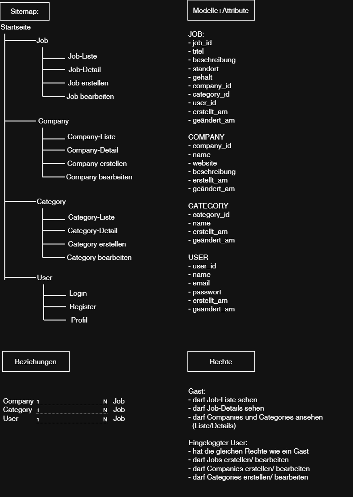

# Job-Portal (TenMedia Aufgabe)

## Beschreibung

Dieses Projekt ist eine Laravel-Webanwendung zur Verwaltung von Stellenanzeigen (Job-Portal).

## Skizze



## Funktionen

* Jobs erstellen, anzeigen und bearbeiten
* Companies verwalten
* Categories verwalten

## Technologien

* PHP 8.x
* Laravel 13
* SQLite (lokale Entwicklung)

## Installation

### Voraussetzungen

* PHP
* Composer
* Git

```bash
git clone https://github.com/JonasTaenzer/TenMedia_project
cd job-portal
composer install
cp .env.example .env
php artisan key:generate
```

```bash
touch database/database.sqlite
php artisan migrate
php artisan serve
```

Dann im Browser öffnen:
http://127.0.0.1:8000

## Hinweis

* Für die Erstellung eines Jobs muss mindestens eine Company und eine Category existieren.
Ein Testbenutzer wird benötigt, da Jobs einem User zugeordnet sind.
* SQLite wird verwendet.

## Autor

Jonas Tänzer